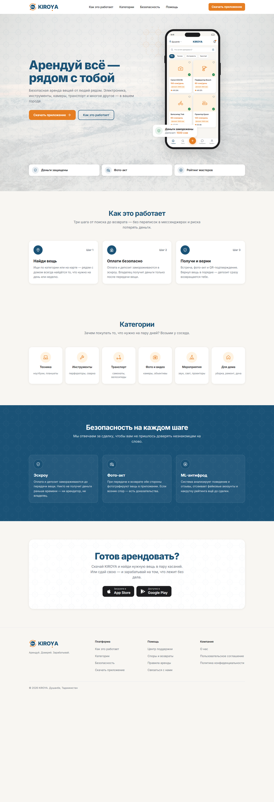

# KIROYA — Аренда вещей в Таджикистане

**KIROYA (Кироя)** — первая P2P-платформа аренды вещей в Таджикистане (старт — Душанбе).
Люди сдают друг другу технику, инструменты, транспорт и вещи для мероприятий.
Деньги и залог замораживаются на эскроу до возврата вещи, передача фиксируется
фото-актом, а рейтинг доверия защищает обе стороны сделки.

**Платформы:** веб-сайт (каталог, вход по SMS, профиль) · Telegram-бот · мобильное приложение (Flutter, в планах).



## Стек

| Часть | Технологии |
|---|---|
| Backend | Python 3.14, FastAPI, SQLAlchemy 2 (async) + asyncpg, Alembic, Pydantic 2 |
| Данные | PostgreSQL 17 + PostGIS, Redis 7, MinIO (S3) |
| Фоновые задачи | Celery + Redis, Flower |
| Авторизация | Номер телефона + SMS-код (OTP), JWT (access + refresh) |
| Web | Next.js 14 (App Router), TypeScript, Tailwind CSS, Zustand, Radix Dialog, sonner, Vitest |
| Бот | aiogram 3, httpx, Redis FSM |
| Инфраструктура | Docker Compose, GitHub Actions |

## Ссылки

- Сайт: https://kiroya.tj
- Telegram-бот: [@kiroyoa_bot](https://t.me/kiroyoa_bot)
- API-документация (локально): http://localhost:8000/docs
- Flower (локально): http://localhost:5555

## Структура репозитория

```
web/       Next.js сайт (kiroya.tj): лендинг, каталог, карточка, вход, профиль
backend/   FastAPI + PostgreSQL + Redis + Celery
bot/       Telegram-бот (aiogram 3)
mobile/    Flutter-приложение (каркас, ещё не начато)
ml/        ML-антифрод (каркас)
docs/      Документация и правила
design/    Логотипы, макеты, дизайн-система (web/design — макеты лендинга)
.github/   CI, шаблон PR, CODEOWNERS
```

## Быстрый старт (Docker — одной командой)

Нужен только [Docker Desktop](https://www.docker.com/products/docker-desktop/). Python, Node, Postgres, Redis, MinIO ставить не нужно.

```bash
git clone https://github.com/Magasah/arednda-tj.git
cd arednda-tj
make setup                      # .env из шаблона + случайные SECRET_KEY и пароли
                                # Windows без make: scripts\setup.ps1
                                # вручную: cp .env.example .env и впиши SECRET_KEY=$(openssl rand -hex 32)
docker compose up --build

# Готово. Сервисы доступны:
# http://localhost:3000       — сайт
# http://localhost:8000       — API
# http://localhost:8000/docs  — Swagger
# http://localhost:9001       — MinIO Console (логин/пароль — MINIO_ACCESS_KEY / MINIO_SECRET_KEY из .env)
# http://localhost:5555       — Flower (Celery)
```

Первый запуск — 2–5 минут (сборка образов). Backend сам ждёт БД, накатывает миграции и сид категорий.
Старый Docker без плагина compose v2 — та же команда через `docker-compose`.

**Удобные команды** (`make` — Linux/macOS/Git Bash/WSL; на Windows без make — `scripts/*.ps1`):

| make | PowerShell | Что делает |
|---|---|---|
| `make setup` | `scripts\setup.ps1` | `.env.example` → `.env` + случайные секреты и пароли |
| `make up` | `scripts\up.ps1` | всё в фоне (без бота) |
| `make up-bot` | `scripts\up.ps1 -WithBot` | вместе с Telegram-ботом (нужен `BOT_TOKEN` в `.env`) |
| `make test` | `scripts\test.ps1` | тесты backend и бота в контейнерах |
| `make logs` / `make down` | — | логи / остановка |
| `make backend-sh` / `make db-sh` | — | shell в backend / psql |
| `make clean` | — | ⚠️ down + удалить volumes (БД, Redis, MinIO) |

PowerShell-скрипты: `powershell -ExecutionPolicy Bypass -File scripts\up.ps1`.

Код входа по SMS в режиме `ENVIRONMENT=development` не отправляется, а пишется в лог backend: `docker compose logs -f backend`.

## Разработка без Docker

Для тех, кто запускает сервисы по отдельности (hot reload, отладчик).
Требования: Python 3.14+, Node 20+, Docker — только для инфраструктуры.
Рекомендуется [uv](https://docs.astral.sh/uv/) — `pyproject.toml` и `uv.lock` есть в `backend/` и `bot/`.

**1. Скопируй `.env` файлы** (в них хосты `localhost`, а не имена docker-сервисов):

```bash
make setup                        # корневой .env — нужен docker compose для db/redis/minio
cp backend/.env.example backend/.env
cp bot/.env.example bot/.env
cp web/.env.example web/.env.local
```

Пароли `POSTGRES_PASSWORD` и `MINIO_SECRET_KEY` в `backend/.env` должны совпадать с корневым `.env`.

**2. Запусти инфраструктуру**

```bash
docker compose up -d db redis minio
```

**3. Backend** (http://localhost:8000/docs)

```bash
cd backend
python -m venv .venv
.venv\Scripts\activate          # Windows
source .venv/bin/activate       # macOS/Linux
pip install -r requirements-dev.txt
alembic upgrade head
python -m scripts.seed_categories
uvicorn app.main:app --reload --reload-dir app
```

**4. Frontend** (http://localhost:3000)

```bash
cd web
npm install
npm run dev
```

**5. Telegram-бот** (нужен `BOT_TOKEN` от @BotFather в `bot/.env`)

```bash
cd bot
python -m venv .venv && source .venv/bin/activate   # или .venv\Scripts\activate
pip install -r requirements.txt
python main.py
```

## Тесты

```bash
make test                     # всё в контейнерах (или scripts\test.ps1)

# без Docker:
cd backend && pytest -v       # нужны db и redis из docker compose
cd bot && pytest -v
cd web && npm run lint && npm test && npm run build   # vitest + Testing Library
```

## Для ИИ-агентов (Claude, Cursor, ChatGPT)

Читай [`docs/AI_START_HERE.md`](docs/AI_START_HERE.md) перед любой работой.

## Документация

- [docs/AI_START_HERE.md](docs/AI_START_HERE.md) — точка входа для ИИ
- [docs/ARCHITECTURE.md](docs/ARCHITECTURE.md) — структура кода
- [docs/DESIGN_SYSTEM.md](docs/DESIGN_SYSTEM.md) — цвета, компоненты
- [docs/AI_RULES.md](docs/AI_RULES.md) — правила для ИИ
- [docs/WORK_LOG.md](docs/WORK_LOG.md) — история изменений
- [docs/CONTRIBUTING.md](docs/CONTRIBUTING.md) — окружение, стиль кода, коммиты, PR

## Лицензия

Proprietary. Все права защищены KIROYA Team.
